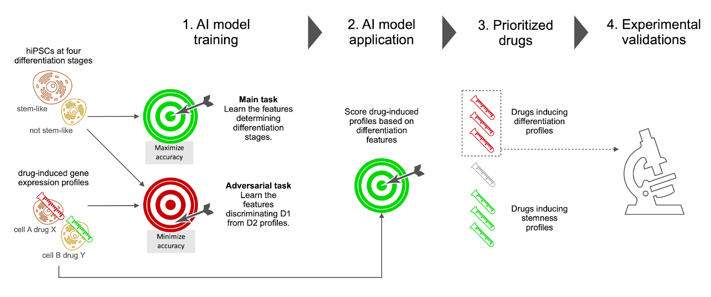
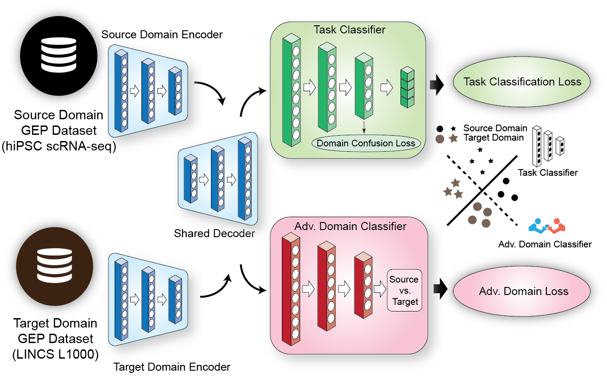

# DREDDA: Drug Repositioning through Expression Data Domain Adaptation
## Overview

This repository contains the implementation of DREDDA from

```
Zhongxiao Li, Antonella Napolitano, Monica Fedele, Xin Gao*, Francesco Napolitano* 
"AI identifies potent inducers of breast cancer stem cell differentiation based on adversarial learning from gene expression data" bioRxiv, 2023
```

If you use our work in your research, please cite our paper, which is now available on [bioRxiv](https://www.biorxiv.org/content/10.1101/2023.08.21.554075v1)


<div align="center">
  

  Fig. 1 Overview of the study. Single-cell gene expression profiles of hIPSCs at various differentiation stages and drug-induced gene expression profiles were fed to an adversarial learning model, which simultaneously learned differentiation features to be used in subsequent predictions (main task) and dataset specific features to be avoided (adversarial task). The trained model was then used to score all the drug-induced profiles. A selection of 6 drugs among the top scoring ones was experimentally validated.
</div>

## The architecture of DREDDA
<div align="center">
  

  Fig. 2 The DREDDA model architecture includes one encoder for each dataset and a shared decoder; the resulting profiles from the source domain are sent to the main task classifier (positively weighted in the overall loss function), while both source and target domain profiles are sent to the adversarial classifier (negatively weighted).
</div>

## Installation
The code is tested with the following dependencies:
- Python 3.7.10
- Pytorch 1.6.0
- Torchvision 0.7.0
- Numpy 1.20.2
- Scipy 1.6.2
- Pandas 1.2.4
- PyTables 3.6.1
- h5py 2.10.0

To automatically install the package and the dependencies use `pip install -e .` at the root directory of this repo.
## Reproducing the LINCS drug list
To run DREDDA with our pretrained checkpoint, simply use
```
python main-DREDDA.py test
```
Relavant files will be downloaded to `download/`. The results will (by default) be saved to `train_dir/default_config/test`.

## Training from scratch
To train DREDDA with the default configuration, simply use
```
python main-DREDDA.py train
```

Relavant files will be downloaded to `download/`. The resulting checkpoints will be saved to `train_dir/default_config/`

The following example shows how to change the default behavior
```
python main-DREDDA.py train \
  --source_dataset_name CRISPRi \
  --target_dataset_name LINCS \
  --out_dir train_dir/default_config \
  --n_epochs 200 \
  --dual_training_epoch 150 \
  --domain_adv_coeff 0.1 \
  --ddc_coeff 0.1 \
  --seed 41 
```

To test a specific checkpoint, please use
```
python main-DREDDA.py test --ckpt_fp <path_to_checkpoint>
```

## Dataset
By default, the dataset use for training and testing and the checkpoints are hosted on the [Amazon AWS](https://aws.amazon.com/). The same data is also available from Zenodo.

[](https://zenodo.org/records/10865460)

## License
This work is licensed under the MIT License.